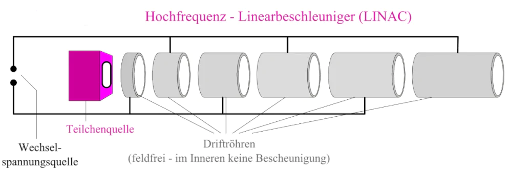

### Braun'sche Röhre

### Linearbeschleuniger
- Hintereinanderschaltung mehrerer Beschleunigungsstrecken (Driftröhren)
- Die Länge der Driftröhren muss von dem Abstand zur Teilchenquelle abhängen, wenn der Beschleuniger mit einer gleichbleibenden Frequenz betrieben werden soll
