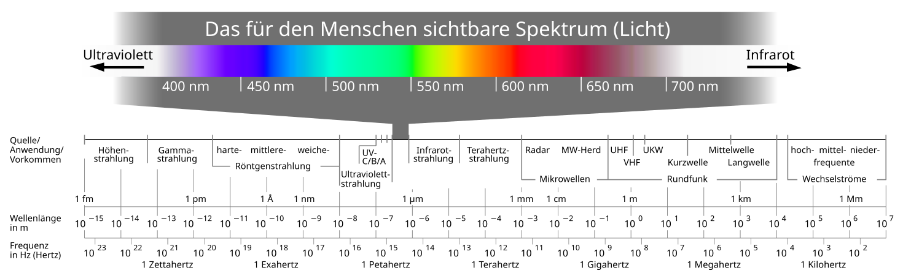

Das Elektromagnetische Spektrum beschreibt die Eigenschaften [elektromagnetischer Strahlung](Elektromagnetische_Wellen.md) abhängig von ihrer Wellenlänge. Das sichtbare Spektrum liegt zwischen $750 \text{ nm}$ und $800\text{ nm}$
