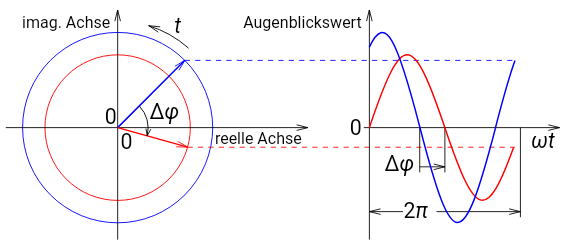

Phasenverschiebung bezeichnet die Verschiebung zweier Periodischer Vorgänge mit der selben Periodendauer bzw. Frequenz, aber nicht den selben Nulldurchgängen

### Phasenwinkel
Periodische Vorgänge, die mit Sinuskurven modelliert werden können sind damit gleichbedeutend mit der Projektion einer Kreisbewegung. Der Winkel zwischen zwei Periodischen vorgängen, wären diese Kreisbewegungen, nennt man **Phasenverschiebungswinkel $\Delta \varphi$**
